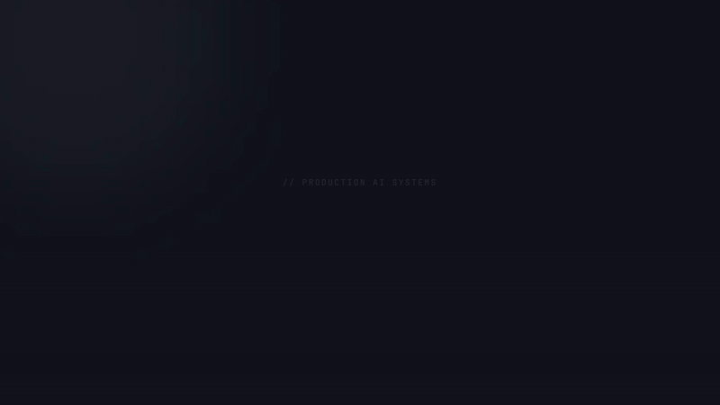

# Jeeban Mohanty | AI Engineer Portfolio

A production-grade, interactive portfolio showcasing my work in **Retrieval-Augmented Generation (RAG)**, **Agentic AI**, and **LLM Engineering**. 

Unlike standard static portfolios, this site features a built-in AI assistant that actually *demonstrates* RAG architecture. It answers questions about my experience, skills, and projects by semantically searching a private vector database and grounding its answers to prevent hallucination.

🔗 **Live Demo:** [https://portfolio-nine-azure-71.vercel.app/](https://portfolio-nine-azure-71.vercel.app/)


*(Please add an `assistant-demo.gif` in the `public` folder showing the widget answering a question with a citation!)*

---

## 🚀 Key Features

*   **RAG-Powered AI Assistant**: Built with Gemini API (`gemini-2.5-flash`) and Qdrant.
*   **Semantic Vector Search**: Uses `text-embedding-004` (768 dimensions) to retrieve contextually relevant information from a custom knowledge base.
*   **Zero-Hallucination Gate**: Implements a strict cosine similarity relevance threshold (0.55). If a question is irrelevant or data is missing, the AI safely refuses rather than hallucinating. Tested against 50+ adversarial and out-of-domain questions to validate the relevance gate's robustness.
*   **Source Attribution**: The UI actively renders citations (e.g., `📄 education/class_10`) to prove where the LLM sourced its information.
*   **Dual-Path Retrieval**: Fast FAQ caching for common questions, falling back to dense vector retrieval for complex/specific queries.

## 🧠 The RAG Architecture

The knowledge base lives in the `jeeban_ai/` directory as Markdown files.

```text
jeeban_ai/ (Markdown Knowledge Base)
    │
    ▼
Ingestion Script (npm run ingest) → Recursive Chunking → Gemini Embeddings
    │
    ▼
Qdrant Cloud (Vector Database)
    │
    ▼
User Question → Query Embedding → Vector Search → Relevance Gate
    │
    ▼
Gemini 2.5 Flash + Grounded Prompt
    │
    ▼
Accurate Answer + Source Citations
```

## 🛠️ Tech Stack

*   **Frontend**: Next.js 16.3 (App Router), React 19, Tailwind CSS v4, TypeScript
*   **LLM & Embeddings**: Google Gemini API (`gemini-2.5-flash`, `text-embedding-004`)
*   **Vector Database**: Qdrant Cloud (REST API)
*   **Deployment**: Vercel

---

## 💻 Local Development

### 1. Clone the repository
```bash
git clone https://github.com/JeebanM/portfolio.git
cd portfolio
```

### 2. Install dependencies
```bash
npm install
```

### 3. Configure Environment Variables
Create a `.env.local` file in the root directory and add your keys:
```env
GEMINI_API_KEY=your_gemini_api_key_here
QDRANT_URL=your_qdrant_cluster_url
QDRANT_API_KEY=your_qdrant_api_key
QDRANT_COLLECTION=jeeban_ai
```

### 4. Ingest the Knowledge Base
Before chatting with the AI, you must vectorize the markdown files in `jeeban_ai/` and push them to Qdrant:
```bash
npm run ingest
```
*(This script reads the markdown files, chunks them, generates 768-dim embeddings, and upserts them to Qdrant.)*

### 5. Run the Dev Server
```bash
npm run dev
```
Open [http://localhost:3000](http://localhost:3000) with your browser to see the portfolio.

---

## 🌐 Deployment

This Next.js app is optimized for [Vercel](https://vercel.com/). 

1. Push your code to GitHub.
2. Import the repository in Vercel.
3. Add the 4 environment variables (`GEMINI_API_KEY`, `QDRANT_URL`, `QDRANT_API_KEY`, `QDRANT_COLLECTION`) in the Vercel Dashboard Settings.
4. Deploy!

*(Note: You do not need to run the ingestion script on Vercel. Ingestion is run locally whenever you update your markdown files, pushing the new vectors to your Qdrant Cloud cluster.)*
